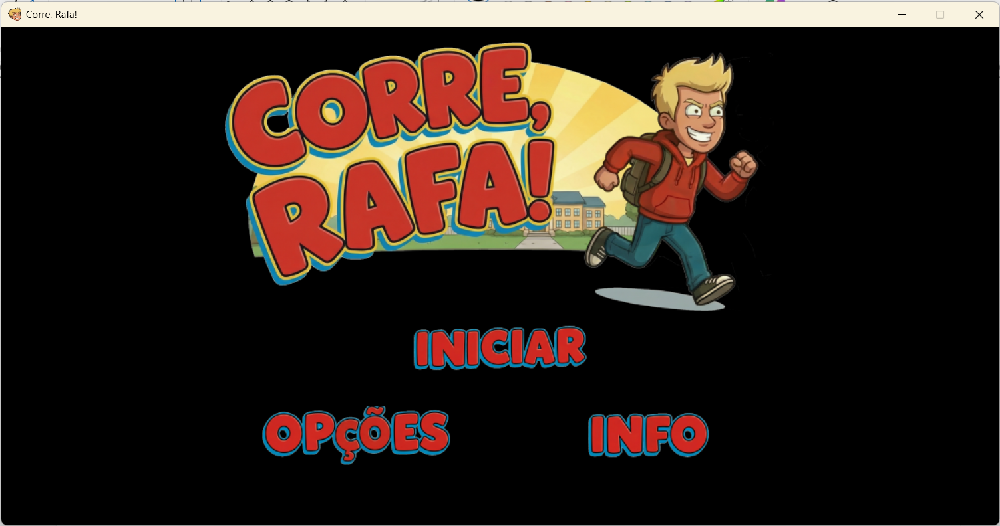
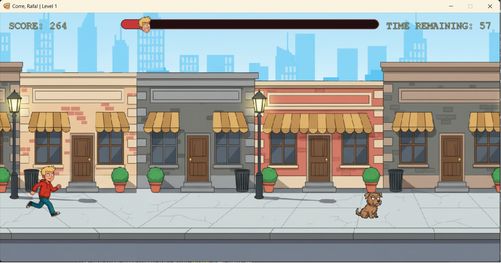
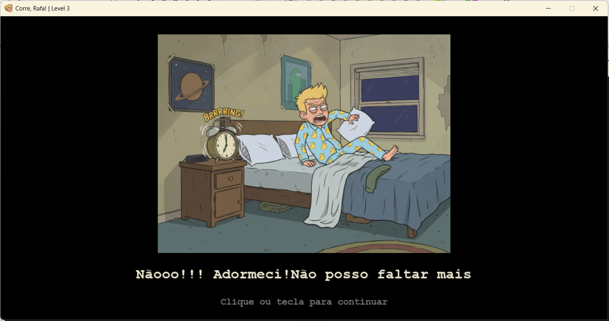

# Corre, Rafa!

## Descrição
Jogo 2D em Python com Pygame no estilo runner, com campanha por níveis, storyboard, menus customizados e sistema de Hall of Fame (Top 5).

O jogador controla o Rafa, evita obstáculos, gere velocidade, ganha/ perde pontos e recebe bónus por tempo restante no fim de cada nível.

## Screenshots






## Jogar (Windows)

### Opção 1: Executável Standalone (Recomendado)
- Não necessita Python instalado
- Duplo clique em `dist/CorreRafa.exe` na pasta do projeto
- Para atalho no Ambiente de Trabalho: copiar `Corre Rafa.lnk` para o Desktop ou arrastar `dist/CorreRafa.exe` para o Desktop

### Opção 2: Python (Desenvolvimento)
Requisitos:
- Python 3.x
- pygame

```bash
pip install pygame
python game_logic.py
```

### Atalho Rápido
Um atalho pré-criado `Corre Rafa.lnk` já existe na pasta do projeto para facilitar o acesso ao jogo no Desktop.

## Controles
- `Seta Cima` ou `Espaço`: saltar
- `Seta Baixo`: baixar
- `Seta Direita`: acelerar
- `Seta Esquerda`: travar
- `R`: reiniciar quando perde
- `ESC`: voltar/sair de ecrãs de menu

## Pontuação
- Progressão contínua: `pontos += vel_jogo * 0.12`
- Obstáculo ultrapassado: `+20`
- Colisão: `-20` (mínimo 0)
- Vitória no nível: `bonus_tempo = int(remaining * 20)`

No fim da campanha:
- se a pontuação final entrar no Top 5, é pedido nome ao jogador
- o Hall of Fame é mostrado com colunas Nome/Pontuação

## Funcionalidades principais
- Campanha com 3 níveis e dificuldade crescente
- Boards de nível e storyboard narrativo
- Ecrã Info com submenu: História, Comandos e Créditos
- Ecrã final com imagem institucional
- Menu de opções com toggles de Som e Efeitos
- HUD retro com fonte arcade, barra de progresso e marcador
- Hall of Fame persistente em `highscore.txt`

## Estrutura (resumo)
- `game_logic.py`: loop principal e fluxo da campanha
- `entities.py`: classes do jogo (`Player`, `Obstaculo`, `Chuva`)
- `screens.py`: ecrãs gerais (banner, menu, fim de campanha)
- `info_screen.py`: submenu e páginas do Info
- `highscores.py`: lógica de Top 5 e ecrã Hall of Fame
- `options_screen.py`: opções + `ImageAlphabet`
- `storyboard.py`: cenas narrativas
- `level_boards.py`: boards entre níveis
- `utils.py`: helpers de áudio/fonte/assets
- `constants.py`: constantes globais
- `assets/`: imagens e sons
- `dist/CorreRafa.exe`: executável standalone (independente, sem Python necessário)
- `Corre Rafa.lnk`: atalho rápido para o jogo no Desktop

## Portabilidade
O `dist/CorreRafa.exe` é completamente portátil:
- **Sem dependências externas**: todos os assets e bibliotecas estão embutidos
- **Funciona em qualquer PC Windows**: sem necessidade de Python ou bibliotecas instaladas
- **Persistência de dados**: o ficheiro `highscore.txt` é guardado ao lado do executável
- **Ícone embutido**: o ícone do jogo é parte do executável (não depende de ficheiros externos)

## Créditos
- Projeto base adaptado de: https://github.com/elen-c-sales/dino-run-vecna-edition
- Arte adicional: Nano Banana
